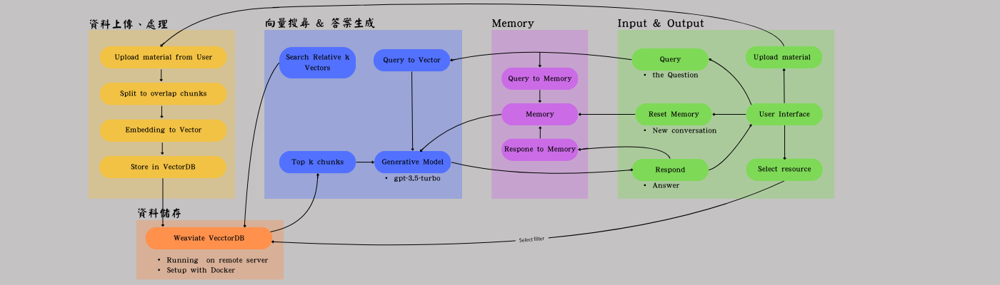

# RAG_learning_assistant
RAG Learning Assistant is a Retrieval-Augmented Generation (RAG) based system that integrates the Weaviate vector database and OpenAI API through a Flask web application, enabling document-based knowledge retrieval and natural language question answering from user-uploaded documents.


## 功能特色
1. 可上傳自定教材來源
使用者可自由上傳 PDF 格式的教材或參考資料，系統將自動化地切割、向量化並索引至知識庫，作為後續問答依據。
2. 具備記憶功能的智慧聊天室
系統具備對話記憶（memory）功能，AI 回答時會自動考慮歷史提問與回覆脈絡，提供更連貫、有條理的回答。
3. 基於可信資料來源生成回應
AI 回答內容大多來自使用者所上傳的資料段落，並明確標示引用來源，提升回答的可驗證性與信任度。
4. 來源篩選控制能力
使用者可以從已上傳的多個教材中**選擇要參考的來源**，避免干擾性資料。

不同於一般將問題直接交由語言模型處理的作法，本專案採用 RAG（Retrieval-Augmented Generation）架構，讓 AI 回答更可控、資訊來源更明確。使用者不僅能掌握回答依據，也能確保 AI 回應更貼近所提供內容，降低幻覺（hallucination）風險。

## 安裝指南
### git 下載
`git clone https://github.com/Moyuan0523/RAG_learning_assistant`
### conda 環境架設
```bash
conda env create -f environment.yml
```

## 使用方式
### Step 1. 
在 app/ 中新建 .env 檔，並加入以下文字：
```
OPENAI_API_KEY = Your_API_key
SERVER_IP = Your_Server_Address
```
### Step 2.
在本地 or 遠端建置 weaviate v3 向量資料庫（本專案利用 Docker 建置）
### Step 3.  
執行 app.py，利用 flask 建置 Developer 私人網站，進入聊天室網頁畫面
### Step 4. 
透過網頁中的 **Upload** 按鈕上傳教材（限 PDF），系統將自動將該教材儲存、分段、向量化、存於遠端的 weaviate 並標記個段的來源
### Step 5.
使用者可從已上傳教材中勾選一份或多份來源，作為 AI 回答的依據範圍，為勾選即預設使用所有資料。
### Step 6.
在聊天室輸入問題，AI 將根據已選資料來源進行語意檢索並回答。  
回答下方可點選「展開引用段落」，即時查看生成依據，協助比對與評估其正確性與可信度。
