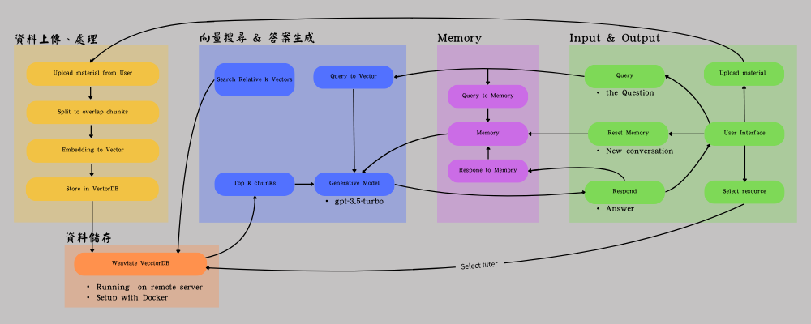

# RAG_learning_assistant
RAG Learning Assistant is a Retrieval-Augmented Generation (RAG) based system that integrates the Weaviate vector database and **OpenAI API or Local LLM (Llama 3.2)** through a Flask web application, enabling document-based knowledge retrieval and natural language question answering from user-uploaded documents.


## ✨ New: Local LLM Support
Now supports deploying **Llama 3.2** locally on your own server! No need to rely on OpenAI API anymore.
Choose between:
- **OpenAI API** (GPT-3.5/GPT-4) - Easy to use, high quality
- **Local Llama 3.2** (1B/3B) - Privacy-focused, cost-effective, full control

📚 **Quick Start Guides:**
- [🚀 5-Minute Quick Start](QUICKSTART.md) - Get Llama 3.2 running fast
- [📖 Complete Deployment Guide](LLAMA_DEPLOYMENT.md) - Detailed instructions for all deployment options

## Features
1. **Custom Sources**
Users can upload their own materials in PDF format.The system will automatically segment, vectorize, and index the content into the knowledge base for downstream question answering.
2. **Intelligent Chat with Memory**
The system features a conversaction memory mechanism. AI considers previous questions and answers to provide more coherent and context-aware responses.
3. **Answering Questions on Trusted Sources**
AI responses are primarily generated from the content of user-uploaded documents.
Each answer includes clearly marked citations to improve verifiability and trustworthiness.
4. **Source Selection and Control**
Users can choose specific sources from uploaded materials to be used for answering, helping to avoid interference from irrelevant documents.
5. **Flexible LLM Backend** 🆕
Switch between OpenAI API and self-hosted Llama 3.2 with a simple configuration change.

Instead of generating answers purely from a language model, this project uses a Retrieval-Augmented Generation (RAG) approach to improve control and transparency.
Users can trace the source of each response, reducing hallucination and ensuring relevance to the uploaded content.

## installing
```bash
# Clone the repository
git clone https://github.com/Moyuan0523/RAG_learning_assistant

# Navigate into the directory
cd RAG-learning_assistant

# Install dependencies
conda env create -f environment.yml
```

## Runnung the Application
### Step 1. set up the enviornment
Create a `.env` file in `app/`，and add the text of following：
```
OPENAI_API_KEY = Your_API_key
SERVER_IP = Your_Server_Address:Database_Port
```
### Step 2. Start the weaviate vector database (via Docker)
Set up Weaviate v3 on your remote server using Docker
### Step 3. Run the Flask web application
```bash
python app.py
```
then Access the interface
- http://127.0.0.1:5000
### Step 4. Upload your document
Click **Upload** on the wed interface to upload PDFs. The system wil automatically chunk, index and mark their source into Weaviate.
### Step 5. Select sources
Select single or multiple source for answering on web interface (Default using all source when selecting nothing.)
### Step 6. Ask questions
Asking questions in the chat, AI retrieves and answers based on selected sources.
Click "Expand Reference" to view the supporting content and assess answer accuracy.

---

## 🛠️ Development Guide

This project uses **pre-commit hooks** and **GitHub Actions CI** to enforce code quality.

### Setup (for developers)
```bash
# Install dev tools
pip install pre-commit ruff detect-secrets

# Install git hooks (run once after cloning)
pre-commit install
```

### What gets checked on every commit
| Hook | Description |
|------|-------------|
| **Ruff lint** | Python linting (pycodestyle, pyflakes, import sorting, security) |
| **Ruff format** | Consistent code formatting |
| **detect-secrets** | Prevents accidental commit of API keys / secrets |
| **Trailing whitespace** | Removes trailing spaces |
| **End-of-file fixer** | Ensures files end with newline |
| **YAML / JSON check** | Validates config file syntax |

### Manual checks
```bash
# Run all hooks on all files
pre-commit run --all-files

# Run only linting
ruff check .

# Auto-fix lint issues
ruff check --fix .

# Format code
ruff format .
```

### CI/CD
GitHub Actions automatically runs the same checks on every push to `main` and on pull requests. See `.github/workflows/lint.yml`.

---

## 🆕 LLM-as-a-Judge: Automated QA Dataset Generation

Generate high-quality test datasets for your RAG system using **adversarial dual-LLM architecture**!

### 🎯 What is LLM-as-a-Judge?

A sophisticated system that uses two independent LLMs to generate and validate question-answer pairs:
- **Generator (Qwen 2.5)**: Creates QA pairs from document chunks
- **Evaluator (Llama 3.2)**: Strictly validates quality (PASS/REJECT)
- **Automatic Retry**: Regenerates rejected pairs for maximum quality

### 🚀 Quick Start

```bash
# 1. Test remote Ollama connection
python testing/test_remote_ollama.py

# 2. Generate 50 golden QA pairs
python generate_golden_dataset.py \
    --input chunks/data_mining.pkl \
    --output datasets/golden_qa.json \
    --count 50

# 3. Or use the interactive menu
./start.sh
```

### 📊 Server Configuration

```
Server:      140.116.96.66:11434
Generator:   qwen2.5:7b-instruct-q4_K_M (4.68 GB)
Evaluator:   llama3.2:3b (2.02 GB)
Status:      ✅ All tests passed
```

### 📚 Documentation

- **[Complete Guide](building_note/LLM_AS_JUDGE.md)** - Full documentation
- **[Config Summary](CONFIG_SUMMARY.md)** - Quick reference
- **[Server Alignment](building_note/SERVER_CONFIG_ALIGNMENT.md)** - Configuration details

### 🎁 Benefits

- ✅ **100% Private**: All processing on your server
- ✅ **Zero Cost**: Only electricity (no API fees)
- ✅ **High Quality**: Dual-LLM validation reduces hallucinations
- ✅ **Scalable**: Generate thousands of QA pairs automatically

**Perfect for:**
- Testing different chunking strategies
- Evaluating RAG system performance
- Creating training datasets for fine-tuning
- Benchmarking retrieval algorithms

---
