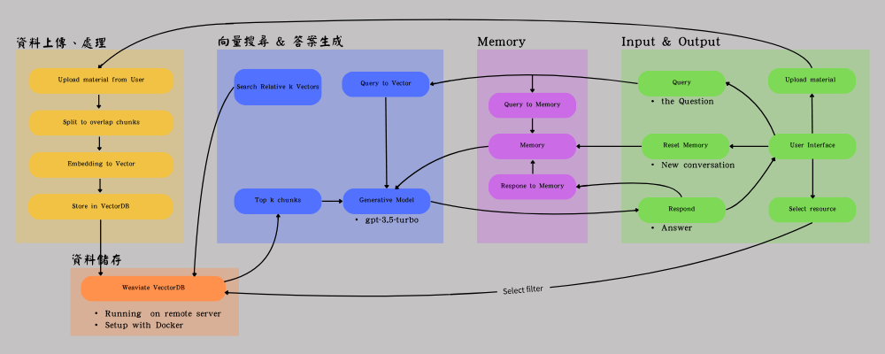

# RAG_learning_assistant
RAG Learning Assistant is a Retrieval-Augmented Generation (RAG) based system that integrates the Weaviate vector database and OpenAI API through a Flask web application, enabling document-based knowledge retrieval and natural language question answering from user-uploaded documents.


## Features
1. Custom Sources  
Users can upload their own materials in PDF format.The system will automatically segment, vectorize, and index the content into the knowledge base for downstream question answering.  
2. Intelligent Chat with Memory  
The system features a conversaction memory mechanism. AI considers previous questions and answers to provide more coherent and context-aware responses.  
3. Answering Questions on Trusted Sources  
AI responses are primarily generated from the content of user-uploaded documents.
Each answer includes clearly marked citations to improve verifiability and trustworthiness.  
4. Source Selection and Control  
Users can choose specific sources from uploaded materials to be used for answering, helping to avoid interference from irrelevant documents.  

Instead of generating answers purely from a language model, this project uses a Retrieval-Augmented Generation (RAG) approach to improve control and transparency.
Users can trace the source of each response, reducing hallucination and ensuring relevance to the uploaded content.

## installing
### Using conda
```bash
conda env create -f environment.yml
```

## How to Run the project
### Step 1. set up the enviornment 
Create a `.env` file in `app/`，and add the text of following：
```
OPENAI_API_KEY = Your_API_key
SERVER_IP = Your_Server_Address:Database_Port
```
### Step 2. Start the weaviate vector database (via Docker)
Set up Weaviate v3 on your remote server using Docker 
### Step 3. Run the Flask web application
```bash
python app.py
```
### Step 4. Upload your document
Click **Upload** on the wed interface to upload PDFs. The system wil automatically chunk, index and mark their source into Weaviate.
### Step 5. Select sources
Select single or multiple source for answering on web interface (Default using all source when selecting nothing.)
### Step 6.
Asking questions in the chat, AI retrieves and answers based on selected sources.
Click “Expand Reference” to view the supporting content and assess answer accuracy.

